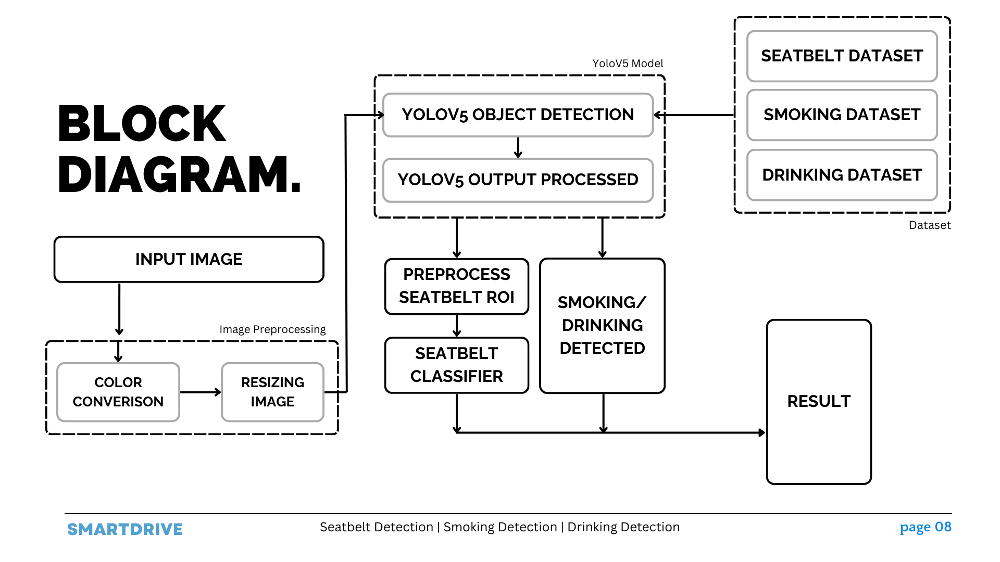
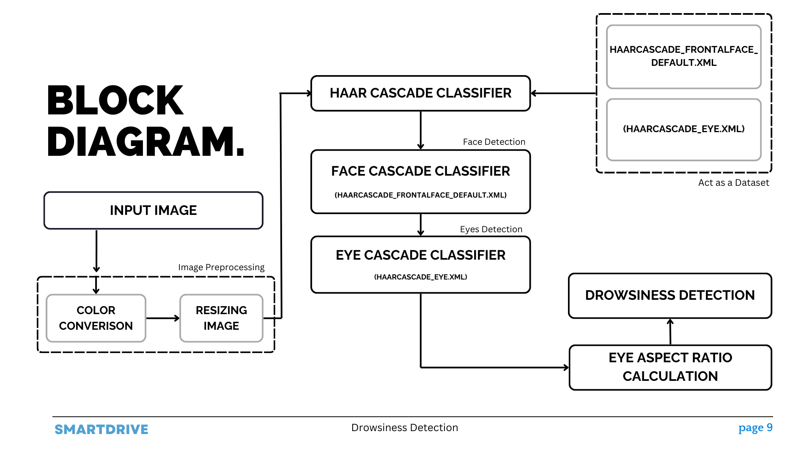
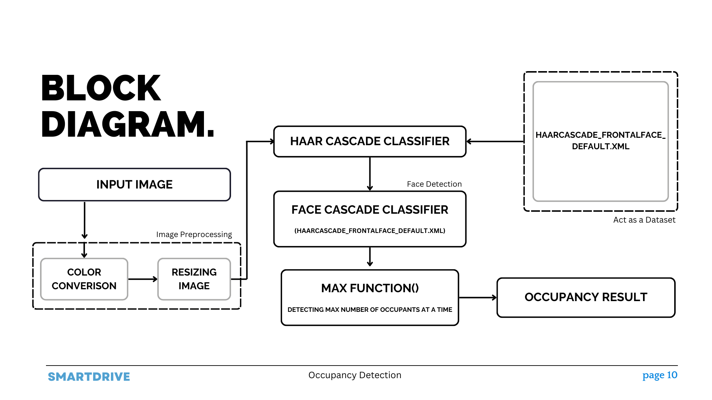

# SmartDrive

<br/>

<p align="center">
  <a href="#table-of-contents"><b>Explore the docs »</b></a>
  <br />
  <br />
  <a href="#architecture-and-design">Architecture</a>
  &nbsp;&nbsp;·&nbsp;&nbsp;
  <a href="#demonstration">Features</a>
  &nbsp;&nbsp;·&nbsp;&nbsp;
  <a href="#contributing">Local Setup</a>
  <br />
</p>

## Table Of Contents

- [About the Project](#about-the-project)
- [Architecture](#architecture)
- [Demonstration & Features](#demonstration)
- [Technologies Used](#technologies-used)
- [Contributing](#contributing)
<!-- - [License](#license) -->
- [Authors](#authors)

## About The Project

**Problem Statement**

Despite automotive technology advancements, global concern persists regarding driver safety due to increasing vehicle numbers, heightening accident risks. Our project aims to tackle this by:

1. Calculating safe driving areas through analysis of roadway conditions.
2. Developing precise lane boundary detection to prevent lane departures.
3. Integrating safety features like Drowsiness, Seat Belt, and Smoking, Drinking and Occupancy Detection to monitor and mitigate driver risks.
4. Providing solution at a sustainable cost for all the drivers.

Through these initiatives, we aim to substantially reduce road accidents and enhance overall road safety.

<br />

**Features**

1. Prioritizing measures and practices aimed for reducing risks and ensuring the well-being of drivers on the road. Enhancing safety through real-time insights and alerts for specific vehicle types.
2. The project scope explicitly excludes integration of autonomous technology, emphasizing a focus solely on conventional driver-operated systems.
3. The algorithmic solutions for this project are specifically tailored to address safe area calculation, lane detection, and driver behavior monitoring. Safe area calculation algorithms are designed to identify and analyze potential hazards within the driving environment.
4. Aiming to promote responsible habits without involving hardware components in all vehicle types.

## Requirements

- cv2==4.8.0
- numpy
- torch
- opencv-python
- opencv-contrib-python
- ultralytics
- cvzone

## Architecture

The architecture:


<br />

<br />

<br />

## Demonstration

<br />
<br />

### Technologies Used

- Computer Vision
- YOLO

<br />

## Contributing

**Local Setup || Project Structure**

NOTE: Individual instructions can be found in respective directories.

```
*
├───Module 1 - BackCam
├───Module 2.1 - FrontCam
├───Module 2.2 - FrontCam
├───Module 2.3 - FrontCam
├───Module 2.4 - FrontCam
├───Module 2.5 - FrontCam
├───Safe-lane-detection
└───App.py
```

- `Module 1 - BackCam`: Safe lane detection.
- `Module 2.1 - FrontCam`: Drinking detection.
- `Module 2.2 - FrontCam`: Drowsiness detection.
- `Module 2.3 - FrontCam`: Smoking detection.
- `Module 2.4 - FrontCam`: Seatbelt detection.
- `Module 2.5 - FrontCam`: Occupancy detection.

<br />
<br />

## Installation

To set up the project locally, follow these steps:

1. **Clone the repository**

   ```sh
   git clone https://github.com/your_username/SmartDrive.git
   cd SmartDrive
   ```

2. **Install the required packages**
   pip install -r requirements.txt

3. **Install specific versions of the required libraries**
   pip install cv2==4.8.0
   pip install numpy
   pip install torch
   pip install opencv-python
   pip install opencv-contrib-python
   pip install ultralytics
   pip install cvzone

4. **Run the application**
   python App.py

## Authors

- Om Shete
  - [LinkedIn](https://www.linkedin.com/in/om-shete-25748522a/)
- Mohib Abbas Sayed
  - [LinkedIn](https://www.linkedin.com/in/mohib-abbas-sayed-83837422a/?utm_source=share&utm_campaign=share_via&utm_content=profile&utm_medium=android_app)
- Hamza Sayyed
  - [LinkedIn](https://shorturl.at/hjAEI)
